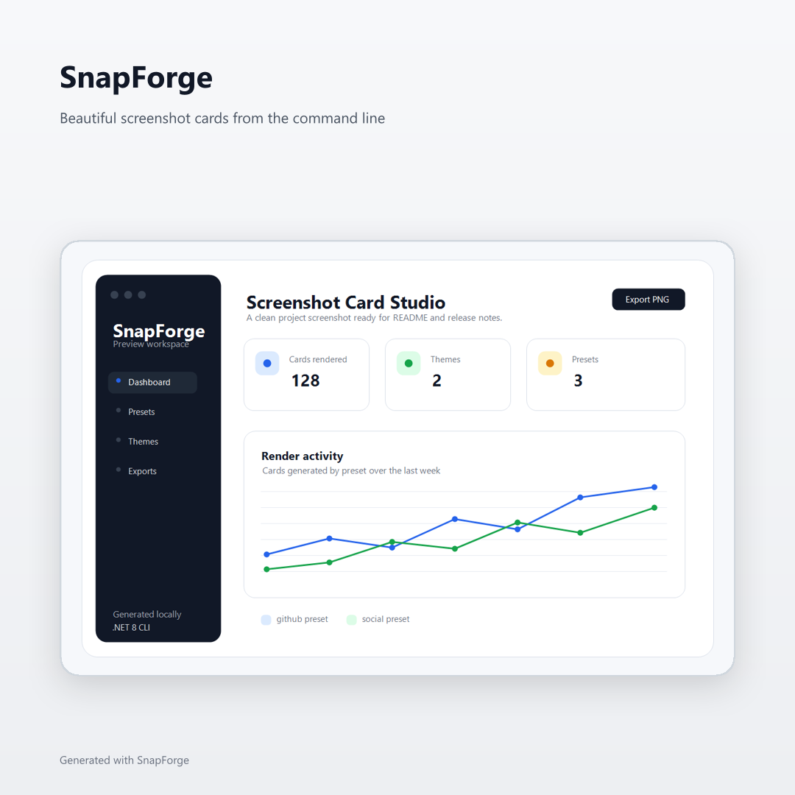
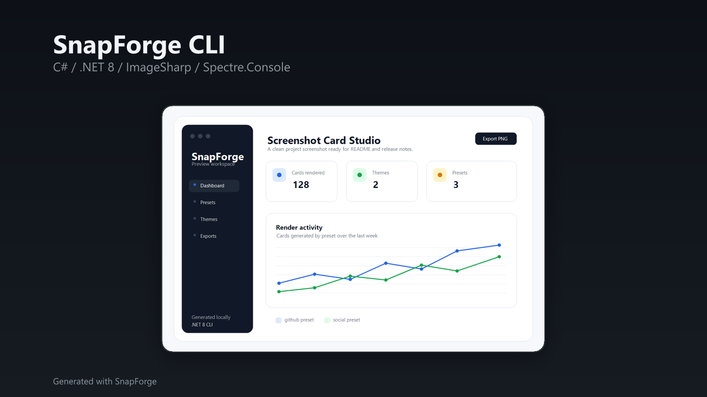

# SnapForge

Turn plain screenshots into beautiful GitHub-ready cards.

SnapForge is a small C#/.NET CLI that turns ordinary screenshots into polished PNG cards for GitHub READMEs, portfolios, changelogs, social posts, and project presentations.

## The Problem

Project screenshots are useful, but raw screenshots often look unfinished when dropped directly into a README or release note. They can have inconsistent dimensions, no context, awkward cropping, and no visual treatment around the actual interface.

Developers should not need a design tool just to make a clean project card.

## The Solution

SnapForge takes a source screenshot, wraps it in a minimal themed layout, and exports a ready-to-use PNG card with:

- a clean background;
- title and subtitle text;
- a framed screenshot;
- rounded screenshot corners;
- a soft screenshot shadow;
- a subtle border;
- a small `Generated with SnapForge` attribution.

The goal is not to replace design software. The goal is to make the common case fast, consistent, and pleasant.

## Quick Start

Requirements:

- .NET 8 SDK
- A PNG/JPG screenshot to use as input

Clone and run locally:

```bash
git clone https://github.com/rndv1/SnapForge.git
cd SnapForge
dotnet restore
dotnet build
```

Generate a card:

```bash
dotnet run --project src/SnapForge.Cli -- card ./examples/input/sample.png \
  --output ./examples/output/sample-card.png \
  --title "SnapForge" \
  --subtitle "GitHub-ready screenshots" \
  --preset github \
  --theme dark \
  --background "#0F172A"
```

Windows PowerShell:

```powershell
dotnet run --project src/SnapForge.Cli -- card .\examples\input\sample.png `
  --output .\examples\output\sample-card.png `
  --title "SnapForge" `
  --subtitle "GitHub-ready screenshots" `
  --preset github `
  --theme dark `
  --background "#0F172A"
```

## Install As A .NET Tool

SnapForge can be packed and installed locally as a .NET tool:

```bash
dotnet pack src/SnapForge.Cli/SnapForge.Cli.csproj --configuration Release --output artifacts/packages
dotnet tool install --global SnapForge --add-source ./artifacts/packages
```

Then run it with the tool command:

```bash
snapforge card ./examples/input/sample.png \
  --output ./examples/output/sample-card.png \
  --title "SnapForge" \
  --subtitle "GitHub-ready screenshots" \
  --preset github \
  --theme dark \
  --background "#0F172A"
```

To uninstall the local tool:

```bash
dotnet tool uninstall --global SnapForge
```

## CLI

```bash
snapforge card <input> --output <output> --title <title> --subtitle <subtitle> --preset <preset> --theme <theme> [--background <hex>]
```

During local development, use:

```bash
dotnet run --project src/SnapForge.Cli -- card <input> --output <output> --title <title> --subtitle <subtitle> --preset <preset> --theme <theme> [--background <hex>]
```

Example:

```bash
dotnet run --project src/SnapForge.Cli -- card ./examples/input/api-screen.png \
  --output ./examples/output/api-card.png \
  --title "GrowthOS API" \
  --subtitle "ASP.NET Core / PostgreSQL / Docker" \
  --preset github \
  --theme dark \
  --background "#0D1117"
```

`--background` is optional. When it is omitted, SnapForge uses the selected theme background. Hex colors may be passed as `#RRGGBB` or `RRGGBB`.

## Web GUI

SnapForge also includes a small ASP.NET Core Razor Pages interface for generating cards in the browser:

```bash
dotnet run --project src/SnapForge.Web
```

Open the local URL printed by ASP.NET Core, upload a screenshot, choose a preset, theme, and optional custom background color, then download the generated PNG.

## Presets

| Preset | Size | Best for |
| --- | ---: | --- |
| `github` | `1280x720` | README banners, changelog images, project previews |
| `open-graph` | `1200x630` | Open Graph images, link previews, social cards |
| `social` | `1080x1080` | Square social posts and profile updates |
| `portfolio` | `1600x900` | Portfolio case studies and presentation slides |

## Themes

| Theme | Style |
| --- | --- |
| `light` | Soft neutral background, dark text, clean product feel |
| `dark` | GitHub-inspired dark background, light text, subtle contrast |

## Features

- Generates PNG cards from local screenshots.
- Validates the input file path before rendering.
- Creates the output directory when needed.
- Prevents overwriting the original source screenshot.
- Supports `github`, `open-graph`, `social`, and `portfolio` presets.
- Supports `light` and `dark` themes.
- Supports optional custom background colors.
- Renders a title, subtitle, screenshot frame, border, shadow, and attribution.
- Prints a structured console report with input, output, preset, theme, background color, size, and status.
- Provides a local Web GUI for browser-based generation.
- Supports drag-and-drop uploads in the Web GUI.
- Keeps recent generated cards available in the current Web GUI session.

## Before And After

The repository includes a small sample screenshot and generated cards so you can see the visual treatment before running the CLI locally.

<table>
  <tr>
    <th>Input screenshot</th>
    <th>GitHub dark card</th>
  </tr>
  <tr>
    <td></td>
    <td></td>
  </tr>
</table>

<table>
  <tr>
    <th>Social light card</th>
    <th>Portfolio dark card</th>
  </tr>
  <tr>
    <td></td>
    <td></td>
  </tr>
</table>

See [examples/README.md](examples/README.md) for copy-ready commands and naming conventions.

## Project Structure

```text
SnapForge/
├── src/
│   ├── SnapForge.Core/
│   │   ├── Models/
│   │   ├── Presets/
│   │   ├── Rendering/
│   │   ├── Themes/
│   │   └── Utils/
│   ├── SnapForge.Cli/
│   │   ├── Program.cs
│   │   └── Commands/
│   └── SnapForge.Web/
│       ├── Pages/
│       └── wwwroot/
├── tests/
│   └── SnapForge.Tests/
├── examples/
│   ├── input/
│   └── output/
├── README.md
├── LICENSE
└── SnapForge.sln
```

## Development

```bash
dotnet restore
dotnet build
dotnet test
```

Run the CLI from source:

```bash
dotnet run --project src/SnapForge.Cli -- --help
dotnet run --project src/SnapForge.Cli -- card --help
```

Run the Web GUI from source:

```bash
dotnet run --project src/SnapForge.Web
```

See [CONTRIBUTING.md](CONTRIBUTING.md) for branch, pull request, and verification guidelines.

## Why SnapForge?

SnapForge is intentionally small and focused. It is for developers who want a reliable way to create polished visuals without opening a design app, choosing templates, or manually resizing screenshots every time.

The first version keeps the surface area narrow: one command, three presets, two themes, and predictable output.
The current version adds a small Web GUI, an Open Graph preset, and optional custom background colors while keeping the rendering model predictable.

## Roadmap

### MVP

- [x] Console application on .NET 8
- [x] `card` command
- [x] `github`, `social`, and `portfolio` presets
- [x] `light` and `dark` themes
- [x] PNG export
- [x] Rounded screenshot corners, frame, border, and shadow
- [x] Unit tests for preset and theme registries

### Next

- [x] GitHub Actions CI
- [x] Example gallery with real before/after screenshots
- [x] Better render tests around output dimensions
- [x] More polished error messages for invalid image files
- [x] Pack as a local/global .NET tool
- [x] Extract reusable rendering core for future UI surfaces
- [x] Web GUI for generating cards in the browser
- [x] Open Graph preset

### Later

- [x] Drag-and-drop uploads in the Web GUI
- [x] Web GUI render history for the current session
- [x] Custom background colors
- [ ] Optional card padding controls
- [ ] Additional presets for presentation slides
- [ ] JSON config files for repeatable project branding
- [ ] Batch mode for generating multiple cards

## Made With C# And .NET

SnapForge is built with:

- .NET 8
- C#
- Spectre.Console
- Spectre.Console.Cli
- SixLabors.ImageSharp
- SixLabors.ImageSharp.Drawing
- xUnit

It is designed as a practical open-source .NET CLI project: simple architecture, clear responsibilities, and enough tests to keep the core behavior honest.

## License

SnapForge is licensed under the MIT License. See [LICENSE](LICENSE).
