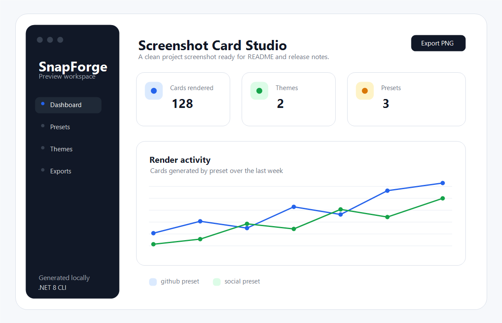
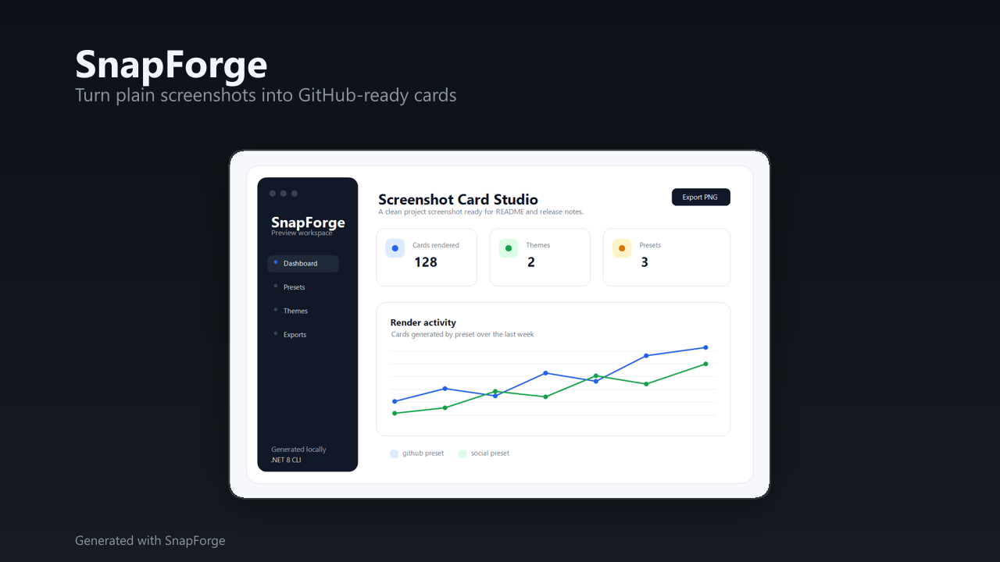

# SnapForge Examples

This directory is for local input screenshots and generated output cards.

```text
examples/
├── input/
│   └── sample.png
└── output/
    ├── sample-github-dark.png
    ├── sample-social-light.png
    └── sample-portfolio-dark.png
```

`examples/output` is ignored by Git except for `.gitkeep` and the documented sample cards in this gallery. Other generated cards stay local by default.

## Prepare An Input Screenshot

Place a screenshot in `examples/input`. For example:

```text
examples/input/sample.png
```

SnapForge accepts image files that ImageSharp can read. PNG screenshots are the recommended input format.

## GitHub README Card

```bash
dotnet run --project src/SnapForge.Cli -- card ./examples/input/sample.png \
  --output ./examples/output/sample-github-dark.png \
  --title "SnapForge" \
  --subtitle "Turn plain screenshots into GitHub-ready cards" \
  --preset github \
  --theme dark
```

Output size: `1280x720`.

## Social Card

```bash
dotnet run --project src/SnapForge.Cli -- card ./examples/input/sample.png \
  --output ./examples/output/sample-social-light.png \
  --title "SnapForge" \
  --subtitle "Beautiful screenshot cards from the command line" \
  --preset social \
  --theme light
```

Output size: `1080x1080`.

## Portfolio Card

```bash
dotnet run --project src/SnapForge.Cli -- card ./examples/input/sample.png \
  --output ./examples/output/sample-portfolio-dark.png \
  --title "SnapForge CLI" \
  --subtitle "C# / .NET 8 / ImageSharp / Spectre.Console" \
  --preset portfolio \
  --theme dark
```

Output size: `1600x900`.

## Before And After Gallery

The sample input screenshot is a synthetic interface created for this repository. The output cards below are generated by SnapForge using the commands in this file.

| Input | Output |
| --- | --- |
|  |  |

| Preset | Theme | Output |
| --- | --- | --- |
| `github` | `dark` | `output/sample-github-dark.png` |
| `social` | `light` | `output/sample-social-light.png` |
| `portfolio` | `dark` | `output/sample-portfolio-dark.png` |

## Notes

- Keep input screenshots small enough to review comfortably in pull requests.
- Do not add generated output images unless they are intentionally part of documentation.
- Use descriptive output names such as `sample-github-dark.png` or `api-card-light.png`.
